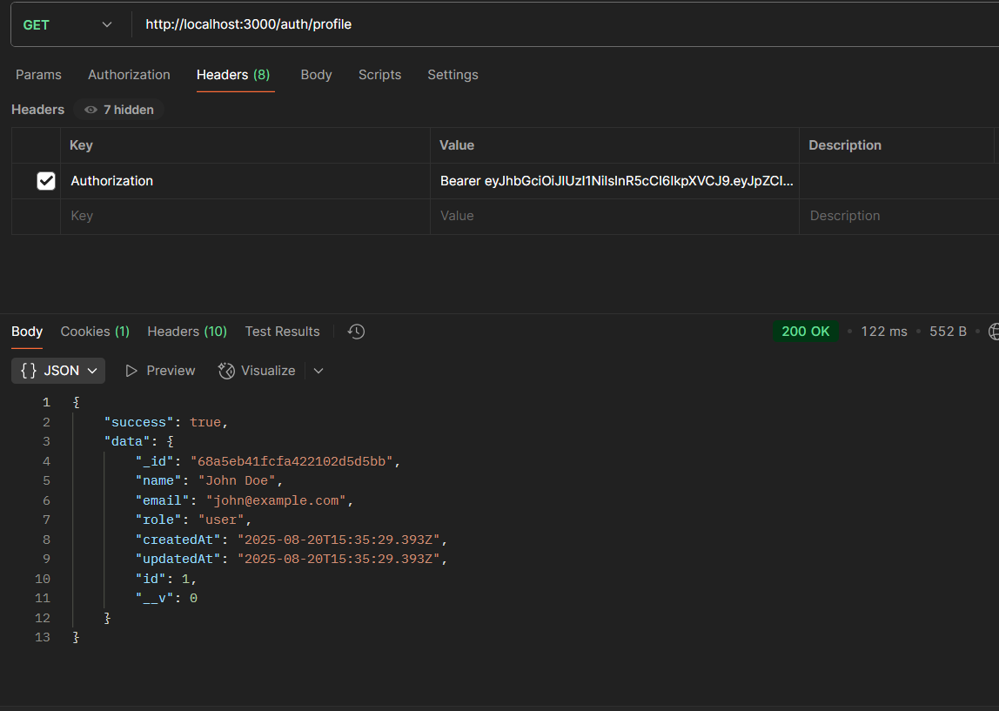

# Smart Device Management System

> This project was built to match these requirements

- [Assignment1](./Assignment1.pdf)
- [Assignment2](./Assignment2.pdf)

## 🛠️ Tech Used

- **Node.js**
- **Express.js**
- **MongoDB + Mongoose**
- **JWT + bcrypt**
- **bcryptjs**
- **express-validator**
- **inngest**(to implement background jobs)
- **jsonwebtoken**
- **mongoose**
- **redis**(to implement rate limiting middlewares)
- **Jest**(to implement unit testing)

## 📬 Postman Collection

You can explore and test the APIs using the Postman collection:

⚠️ **Note:** After logging in, copy the generated JWT token and add it to the request headers (`Authorization: Bearer <your_jwt_token>`) when testing protected routes in Postman.

[Download Postman Collection](./SDMS.postman_collection.json)

## ⚙️ Setup Instructions

### 1. Clone the Repository

```bash
git clone https://github.com/bashirafarhin/Smart-Device-Management-System.git
cd ./Smart-Device-Management-System
```

### 2. Install Dependencies

```bash
npm install/ npm i
```

### 3. Database Setup (MongoDB)

- Go to your MongoDB server (e.g., [MongoDB Atlas](https://www.mongodb.com/atlas)) and create a cluster.
- Copy the connection string (it looks like this:  
  `mongodb+srv://<username>:<password>@cluster0.mongodb.net/your-db-name`).
- Add it to your `.env` file:
- If you prefer using local MongoDB, make sure it is running:
  `Open new terminal and run this`

```bash
mongod
```

### 4. Redis Setup

- Go to your Redis server (e.g., [Redis Cloud](https://redis.com/redis-enterprise-cloud/)) and create a database.
- Copy the connection URL provided (it looks like this:  
  `redis://default:<password>@<host>:<port>`).
- Add it to your `.env` file:

### 5. Inngest setup

`Open new terminal and run this`

```bash
npx inngest-cli@latest dev -u http://localhost:3000/api/inngest
```

### 6. Configure Environment Variables

```bash
PORT=3000
MONGO_URI=
JWT_SECRET=your-jwt-secret-key
REDIS_URL=
ACCESS_TOKEN_SECRET=your-access-secret-key
REFRESH_TOKEN_SECRET=your-refresh-secret-key
NODE_ENV = "development"
```

### 7. Run the Project in Development Mode

```bash
npm run dev
```

## 📌 Assumptions Made

- The assignment did not explicitly mention whether the routes should be protected, but it was assumed that authentication is required for all protected resources (e.g., Device Management, Logs, Usage). Therefore, these routes are secured with JWT-based authentication.

## [📖 Go to API Documentation](./API_DOCS.md)

## 📊 Watch Performance Optimization Proofs

### 1. device listing

#### without cache-158ms


#### with cache-98ms


### 2. user's profile

#### without cache-122ms



#### with cache-107ms


